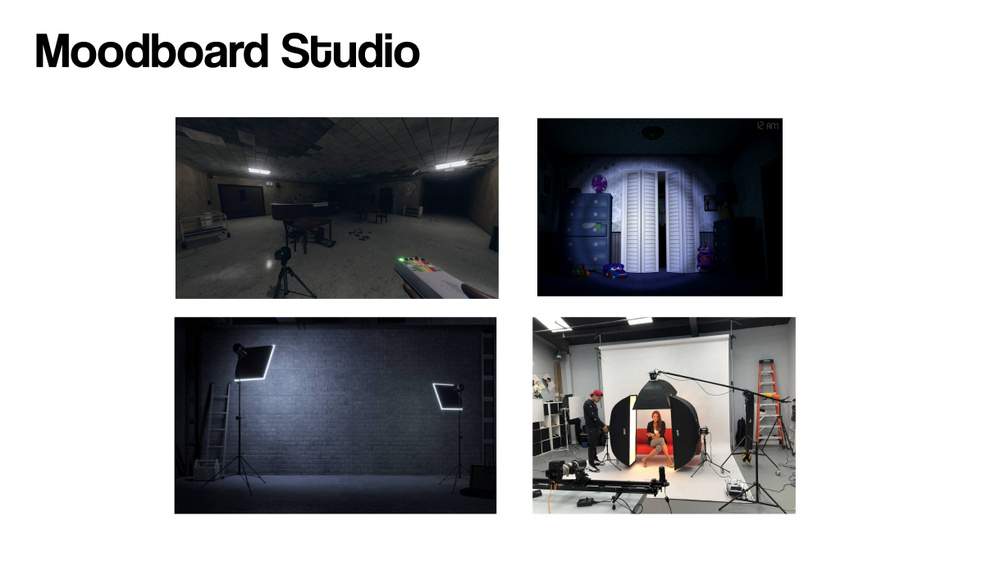
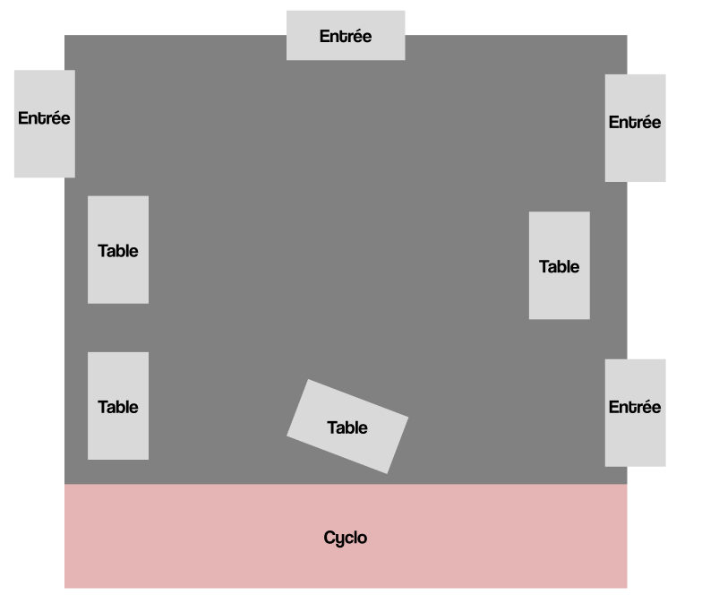
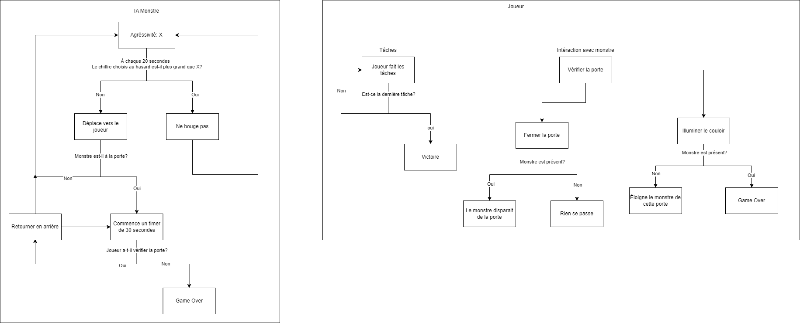

# Plan pour jeu d'horreur "average tim student day"
## Résumé rapide
Un jeu d'horreur simple où on dois compléter certains objectifs avant de devenir une victime du monstre.
## Description
Parmis les plusieurs idée qu'on a brainstorm ensemble, j'ai choisi le jeu d'horreur, d'une part parce que c'est l'idée qu'on a développé le plus et d'autre part, parce que le gameplay est simple à comprendre.
La prémisse du jeu est que tu es le seul étudiant qui est resté dans le grand studio et tu dois ranger tous le matériel avant de partir. Tout le long, il y a *quelque chose* qui te chasse; il faut que tu ferme le portes et illumine les couloirs pour l'éloigner.

## Gameplay
### Joueur
Tout le long que le joueur est dans le studio, il doit compléter plusieurs tâches (similaire au système de tâches dans Among Us) avant qu'il peut partir, tel que débrancher et rouler des câbles, mettre les câbles et l'équipement dans les bonnes boîtes dans les chariots, ne pas endommager l'équipement, etc. (Normalement ce que tu fais lorsque tu range l'équipement après avoir fait du travail dans le studio.) Le joueur est limité à seulement le studio comme zone jouable et le mouvement est limité, puisque tu va être devant une table à faire du travail la majorité du temps.

### Le monstre
Pendant que le joueur fait ses tâches, il y a un monstre qui va inévitablement attraper le joueur si celui-ci ne vérifie pas les entrées du studio. Le monstre va avoir un IA similaire aux animatroniques de Five Nights at Freddy's, où ils ont de base un niveau d'agréssivité et celui-ci est la base du calcul qui se passe qui détermine la prochaine action du monstre; si par exemple, le monstre a une agréssivité de 4, ça veut dire qu'a chaque 20 secondes (peut être régler plus tard) le monstre à 4 chances sur 20 de se déplacer vers le joueur. Si celui-ci arrive au joueur, c'est game over (+ jumpscare possiblement). [Source](https://steamcommunity.com/sharedfiles/filedetails/?id=2995834654) Considérant la nature du jeu, l'IA ne va pas être trop agréssive afin de donner du temps au joueur de progresser. À quoi ceci ressemble est à l'interprétation.

### Survivre le monstre
Inspiré de la mécanique de Five Nights at Freddy's 4, le joueur doit activement vérifier les entrées avec une lampe de poche et bloquer ceux-ci si on entend la présence du monstre. Puisqu'il y a seulement une entrée dans le vrai studio, il faut en rajouter.
Si le joueur illumine la porte et le monstre est là, c'est game over.

### Les niveaux
Le jeu va être divisé en plusieurs niveaux et à chaque niveau que le joueur complète, le IA du monstre deviens de plus en plus agréssive et les tâches deviennent plus nombreuses et complexes.

# Moodboards

## Moodboards visuels
### Environement

### Équipement

## Moodboards sonore
### Room tone
[room tone](https://www.youtube.com/watch?v=z6JCd7gv9h4)
### Porte en métal
[DOORDOORDOOR](https://www.youtube.com/watch?v=Y9sO-aDjeUw)
### Manipulation de l'équipement
[STUFF](https://www.youtube.com/watch?v=o1yg7YsJ4rk)

# Carte
Le grand studio mais avec des portes de plus. (et après un tournage)

# Schéma de programmation

